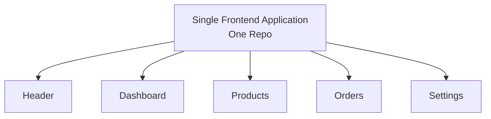
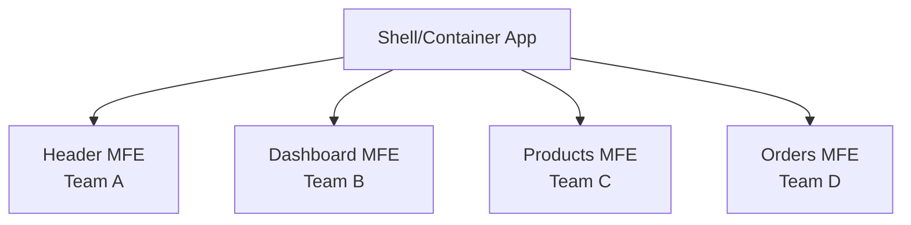

# Microfrontend Architecture
## A Practical Deep Dive

<div class="pt-12">
  <span @click="$slidev.nav.next" class="px-2 py-1 rounded cursor-pointer" hover="bg-white bg-opacity-10">
    Press Space for next page <carbon:arrow-right class="inline"/>
  </span>
</div>

---
layout: center
---

# Today's Journey

<div class="grid grid-cols-3 gap-8 mt-12">

<div v-click="1">

### 🏗️ Architecture
- Module Federation
- Native Federation
- Integration Patterns

</div>

<div v-click="2">

### 💬 Communication
- NgRx Signal Store
- Inter-MFE Messaging
- State Management

</div>

<div v-click="3">

### 🚀 Real Demo
- Independent Deployment
- Live MFE Update
- Zero Host Changes

</div>

</div>

---

# The Problem We're Solving

### What is a Monolithic Frontend?

<v-click>

<div class="text-lg mb-4">
Think of it like a <strong>single massive apartment building</strong> 🏢
</div>

<div class="grid grid-cols-2 gap-4 text-base">

<div>

**The Monolith:**
- One entrance, one exit
- Shared elevator system
- Any maintenance stops everyone
- Must renovate the entire building

</div>

<div>

**Your Frontend:**
- One codebase, one repo
- Shared dependencies
- Any deployment affects everyone
- Must rebuild everything

</div>

</div>

</v-click>

---

# The Problem We're Solving

### Monolithic Frontends Becoming Bottlenecks

<v-clicks>

- Multiple teams working on single codebase
- Long build times (10+ minutes)
- Coordination overhead for deployments
- Technology lock-in
- Difficult to scale teams

</v-clicks>

---
layout: section
---

# Core Concepts

---

# What are Microfrontends?

> **Microservices architecture applied to the frontend**

<v-click>

<div class="text-lg mb-4">
Think of it like <strong>streaming services on your Smart TV</strong> 📺
</div>

<div class="grid grid-cols-2 gap-4 text-base">

<div>

**Your Smart TV:**
- Netflix, YouTube, Prime - separate apps
- Each app updates independently
- YouTube can add features without Netflix knowing
- One app crashing doesn't freeze your TV
- Each service runs its own tech stack

</div>

<div>

**Your Microfrontends:**
- Products, Orders, Profile - separate apps
- Each microfrontend deploys independently
- Products team ships features without coordinating
- One microfrontend failure doesn't break others
- Each team chooses their framework (React/Vue/Angular)

</div>

</div>

</v-click>

<v-click>

<div class="text-center mt-6 text-xl text-blue-400">
Breaking down a frontend monolith into smaller, independently deployable applications
</div>

</v-click>

---

# Architecture Comparison

### Monolith



---

# Architecture Comparison

### Microfrontends



---

# Key Principle: Vertical Slice Ownership

Each team owns:

<v-clicks>

- Frontend microfrontend
- Backend microservices
- Database
- CI/CD pipeline
- Full feature lifecycle

</v-clicks>

---
layout: section
---

# Live Demo

## Working Microfrontend Application

---

# Demo Architecture

<div class="grid grid-cols-2 gap-4">

<div>

```typescript
// Shell Application (Host)
// Port 4200
- Angular 19
- Routing & Navigation
- Layout & Theme

// Header Microfrontend
// Port 4201
- Angular 19
- Top navigation bar
- Cart badge (listens to updates)
```

</div>

<div>

```typescript
// Products Microfrontend
// Port 4202
- Angular 19
- Product catalog & search
- Product filters
- Add to cart (publishes events)

// Cart Microfrontend
// Port 4203
- Angular 19
- Shopping cart management
- Cart summary
- Publishes cart updates
```

</div>

</div>

<v-click>

<div class="mt-6 p-4 bg-blue-900 bg-opacity-30 rounded text-center text-lg">
<strong>Communication Flow:</strong> Products → "Add to Cart" → Cart → Updates Count → Header Badge
</div>

</v-click>

---

# Browser DevTools Deep Dive

**What to observe:**

<v-clicks>

1. Network tab → Multiple bundles loading
2. Different chunk names (header-*, products-*, cart-*)
3. Lazy loading in action
4. Independent versioning
5. Event messages between MFEs

</v-clicks>

---

# Key Observation

**Each microfrontend:**

<v-clicks>

- Loads independently
- Can use different frameworks
- Deployed separately
- Fails gracefully

</v-clicks>

---
layout: section
---

# Integration Patterns
## The "How"

---

# Three Main Approaches

<v-clicks>

1. **Build-time Integration** (NPM packages)
2. **Run-time Integration** (Module Federation)
3. **Framework-agnostic** (Web Components/iframes)

</v-clicks>

---

# 1. Build-time Integration

### Think: Shared Libraries in Backend

```json
// package.json
{
  "dependencies": {
    "@company/header-mfe": "^1.2.3",
    "@company/products-mfe": "^2.0.1",
    "@company/cart-mfe": "^1.5.0"
  }
}
```

---

# Build-time Integration

<div class="grid grid-cols-2 gap-4">

<div>

### Pros ✅
- Simple to implement
- Type safety with TypeScript
- Build-time optimization

</div>

<div>

### Cons ❌
- Must rebuild host for updates
- Tight coupling
- No independent deployment

</div>

</div>

---

# 2. Run-time Integration
### Two Powerful Approaches

<div class="grid grid-cols-2 gap-8 mt-8">

<div class="text-center">

### Module Federation
**Webpack 5+**

<div class="mt-4">
✅ Mature & Battle-tested<br/>
✅ Rich ecosystem<br/>
✅ Complex configurations
</div>

</div>

<div class="text-center">

### Native Federation
**Framework-agnostic**

<div class="mt-4">
✅ Build-tool independent<br/>
✅ Works with Vite, esbuild<br/>
✅ Simpler setup
</div>

</div>

</div>

<v-click>

<div class="text-center text-2xl mt-8 text-green-400">
🚀 Our application uses BOTH!
</div>

</v-click>

---

# Module Federation Config
### Webpack Approach

<div class="grid grid-cols-[60%_40%] gap-4">

<div>

```javascript {all|5-6|7-11|12-16|all}
// products-mfe/webpack.config.js
module.exports = {
  plugins: [
    new ModuleFederationPlugin({
      name: 'products',
      filename: 'remoteEntry.js',
      exposes: {
        './ProductListModule': 
          './src/app/product-list/product-list.module',
        './ProductDetailComponent': 
          './src/app/product-detail/product-detail.component'
      },
      shared: {
        '@angular/core': { singleton: true, strictVersion: true },
        '@angular/common': { singleton: true, strictVersion: true },
        '@angular/router': { singleton: true, strictVersion: true }
      }
    })
  ]
};
```

</div>

<div class="text-xs pl-2">

<div v-click="1" class="mb-6">
<div class="font-bold text-blue-400 mb-1">📦 MFE Identity</div>
<ul class="text-xs">
  <li><strong>name:</strong> Unique ID</li>
  <li><strong>filename:</strong> Entry point</li>
</ul>
</div>

<div v-click="2" class="mb-6">
<div class="font-bold text-green-400 mb-1">📤 Exposed Modules</div>
<ul class="text-xs">
  <li>Public API of MFE</li>
  <li>Importable by other apps</li>
  <li>Maps name → path</li>
</ul>
</div>

<div v-click="3" class="mb-6">
<div class="font-bold text-yellow-400 mb-1">🤝 Shared Dependencies</div>
<ul class="text-xs">
  <li><strong>singleton:</strong> One instance only</li>
  <li><strong>strictVersion:</strong> No conflicts</li>
  <li>Reduces bundle size</li>
</ul>
</div>

</div>

</div>

---

# Shell Application Config
### Webpack Module Federation

<div class="grid grid-cols-[60%_40%] gap-4">

<div>

```javascript {all|5-9|10-13|all}
// shell/webpack.config.js
module.exports = {
  plugins: [
    new ModuleFederationPlugin({
      name: 'shell',
      remotes: {
        header: 'header@http://localhost:4201/remoteEntry.js',
        products: 'products@http://localhost:4202/remoteEntry.js',
        cart: 'cart@http://localhost:4203/remoteEntry.js'
      },
      shared: {
        '@angular/core': { singleton: true, strictVersion: true },
        '@angular/common': { singleton: true, strictVersion: true },
        '@angular/router': { singleton: true, strictVersion: true }
      }
    })
  ]
};
```

</div>

<div class="text-xs pl-2">

<div v-click="1" class="mb-6">
<div class="font-bold text-purple-400 mb-1">🔌 Remote MFEs Registry</div>
<ul class="text-xs">
  <li>Maps MFE name to location</li>
  <li><code class="text-xs">name@url/remoteEntry.js</code></li>
  <li>Like service registry</li>
</ul>
</div>

<div v-click="2" class="mb-6">
<div class="font-bold text-yellow-400 mb-1">🤝 Shared Dependencies</div>
<ul class="text-xs">
  <li>Must match MFEs' config</li>
  <li>Single Angular instance</li>
  <li>No version mismatches</li>
</ul>
</div>

</div>

</div>

---

# Using Remote Components
### Module Federation Approach

```typescript {all|1-2|4-15|17-22|all}
// Shell application - app-routing.module.ts
import { loadRemoteModule } from '@angular-architects/module-federation';

const routes: Routes = [
  {
    path: 'products',
    loadChildren: () => loadRemoteModule({
      remoteEntry: 'http://localhost:4202/remoteEntry.js',
      remoteName: 'products',
      exposedModule: './ProductsModule'
    }).then(m => m.ProductsModule)
  },
  // ... cart and other routes
];

// App component with header
@Component({
  selector: 'app-root',
  template: `
    <app-header></app-header>
    <router-outlet></router-outlet>
  `
})
export class AppComponent { }
```

---

# Native Federation Config
### Framework-Agnostic Approach

<div class="grid grid-cols-[60%_40%] gap-4">

<div>

```javascript {all|5-6|8-10|12-17|19-24|all}
// federation.config.js (Shell)
const { withNativeFederation, shareAll } = 
  require('@angular-architects/native-federation/config');

module.exports = withNativeFederation({
  name: 'shell',
  
  exposes: {
    // Shell can also expose shared components
  },
  
  shared: {
    ...shareAll({ 
      singleton: true, 
      strictVersion: true, 
      requiredVersion: 'auto' 
    }),
  },
  
  skip: [
    'rxjs/ajax',
    'rxjs/fetch',
    'rxjs/testing',
    'rxjs/webSocket',
  ]
});
```

</div>

<div class="text-xs pl-2">

<div v-click="1" class="mb-6">
<div class="font-bold text-blue-400 mb-1">📦 MFE Identity</div>
<ul class="text-xs">
  <li>Unique name for this app</li>
</ul>
</div>

<div v-click="2" class="mb-6">
<div class="font-bold text-green-400 mb-1">📤 Exposed Modules</div>
<ul class="text-xs">
  <li>Optional: Shell can expose too</li>
  <li>Share common components</li>
</ul>
</div>

<div v-click="3" class="mb-6">
<div class="font-bold text-yellow-400 mb-1">🤝 Shared Dependencies</div>
<ul class="text-xs">
  <li><code class="text-xs">shareAll()</code>: Auto-share all deps</li>
  <li><code class="text-xs">requiredVersion: 'auto'</code>: From package.json</li>
</ul>
</div>

<div v-click="4" class="mb-6">
<div class="font-bold text-red-400 mb-1">🚫 Skip List</div>
<ul class="text-xs">
  <li>Exclude heavy/unused modules</li>
  <li>Optimize bundle size</li>
</ul>
</div>

</div>

</div>

---

# Native Federation - Loading Remotes

<div class="grid grid-cols-[60%_40%] gap-4">

<div>

```typescript {all|1-6|8-15|17-22|all}
// src/assets/federation.manifest.json
{
  "header": "http://localhost:4201/remoteEntry.json",
  "products": "http://localhost:4202/remoteEntry.json",
  "cart": "http://localhost:4203/remoteEntry.json"
}

// main.ts - Initialize Native Federation
import { initFederation } from '@angular-architects/native-federation';

initFederation('/assets/federation.manifest.json')
  .catch(err => console.error(err))
  .then(_ => import('./bootstrap'))
  .catch(err => console.error(err));

// app.routes.ts - Load remote
import { loadRemoteModule } from '@angular-architects/native-federation';

{
  path: 'products',
  loadComponent: () =>
    loadRemoteModule('products', './Component')
      .then(m => m.AppComponent)
}
```

</div>

<div class="text-xs pl-2">

<div v-click="1" class="mb-4">
<div class="font-bold text-purple-400 mb-1">📋 Remote Manifest</div>
<ul class="text-xs">
  <li>JSON config for all remotes</li>
  <li>Easy to update without rebuild</li>
  <li>Can be fetched from API</li>
</ul>
</div>

<div v-click="2" class="mb-4">
<div class="font-bold text-blue-400 mb-1">🚀 Initialization</div>
<ul class="text-xs">
  <li><code class="text-xs">initFederation()</code> before app starts</li>
  <li>Loads manifest & prepares remotes</li>
  <li>Then bootstraps Angular app</li>
</ul>
</div>

<div v-click="3" class="mb-4">
<div class="font-bold text-cyan-400 mb-1">⚡ Dynamic Loading</div>
<ul class="text-xs">
  <li>Load MFE in routes/components</li>
  <li>Promise-based API</li>
  <li>Error handling built-in</li>
</ul>
</div>

</div>

</div>

---

# Module Federation vs Native Federation

| Feature | Module Federation | Native Federation |
|---------|-------------------|-------------------|
| **Build Tool** | Webpack 5+ | Any (Vite, esbuild, Rollup) |
| **Entry File** | `remoteEntry.js` | `remoteEntry.json` |
| **Runtime** | Webpack runtime | Import Maps (Web Standard) |
| **Performance** | Good | Excellent (with Vite) |
| **Ecosystem** | Mature | Growing |

<v-click>

<div class="mt-2 p-3 bg-blue-900 bg-opacity-30 rounded text-xs">
<strong>Our Journey:</strong><br/>
• Started with Module Federation when Native Federation wasn't mature<br/>
• Migrating to Native Federation for Angular's esbuild builder & web standards
</div>

</v-click>

---

# Module & Native Federation Benefits

<v-clicks>

- ✅ **True independent deployment**
- ✅ **Runtime composition**
- ✅ **Shared dependencies (no duplication)**
- ✅ **Version management**
- ✅ **Like service discovery for frontend bundles**

</v-clicks>

---

# 3. Web Components / iframes

### Framework-Agnostic Integration

---

# Web Components Example

<div class="grid grid-cols-[60%_40%] gap-4">

<div>

```typescript {all|2|4-8|11-12|all}
// products-mfe creates Angular Element
import { createCustomElement } from '@angular/elements';

@Component({
  selector: 'app-product-list',
  template: '<div>Product List</div>'
})
export class ProductListComponent { }

// Convert to Web Component
const element = createCustomElement(ProductListComponent, { injector });
customElements.define('product-list', element);
```

```html
<!-- Shell uses it -->
<product-list></product-list>
```

</div>

<div class="text-xs pl-2">

<div v-click="1" class="mb-4">
<div class="font-bold text-blue-400 mb-1">📦 Angular Elements</div>
<ul class="text-xs">
  <li>Converts Angular components to Web Components</li>
  <li>Standard browser API</li>
</ul>
</div>

<div v-click="2" class="mb-4">
<div class="font-bold text-green-400 mb-1">🧩 Component Definition</div>
<ul class="text-xs">
  <li>Regular Angular component</li>
  <li>No special MFE code needed</li>
</ul>
</div>

<div v-click="3" class="mb-4">
<div class="font-bold text-purple-400 mb-1">🔧 Registration</div>
<ul class="text-xs">
  <li><code class="text-xs">createCustomElement()</code> wraps component</li>
  <li><code class="text-xs">customElements.define()</code> registers globally</li>
  <li>Can be used anywhere in HTML</li>
</ul>
</div>

<div v-click="4" class="mt-2 p-2 bg-yellow-900 bg-opacity-20 rounded text-xs">
<strong>✅ Pros:</strong> Framework-agnostic, Standard API<br/>
<strong>⚠️ Cons:</strong> Larger bundle, Limited isolation
</div>

</div>

</div>

---

# iframes for Legacy Integration

<div class="grid grid-cols-[60%_40%] gap-4">

<div>

```html {all|2-5|all}
<!-- Shell application -->
<iframe 
  src="http://legacy-app.company.com/products"
  sandbox="allow-scripts allow-same-origin"
>
</iframe>
```

```typescript
// Dynamic iframe loading
const iframe = document.createElement('iframe');
iframe.src = 'http://legacy-app.company.com/products';
iframe.sandbox.add('allow-scripts', 'allow-same-origin');
document.getElementById('container').appendChild(iframe);
```

</div>

<div class="text-xs pl-2">

<div v-click="1" class="mb-4">
<div class="font-bold text-purple-400 mb-1">🔒 Sandbox Security</div>
<ul class="text-xs">
  <li><code class="text-xs">sandbox</code> attribute restricts capabilities</li>
  <li><code class="text-xs">allow-scripts</code>: Enable JavaScript</li>
  <li><code class="text-xs">allow-same-origin</code>: Same-origin access</li>
  <li>Prevents malicious code execution</li>
</ul>
</div>

<div v-click="2" class="mb-4">
<div class="font-bold text-green-400 mb-1">✅ Best For</div>
<ul class="text-xs">
  <li>Gradual migration from legacy apps</li>
  <li>Complete isolation required</li>
  <li>Third-party integrations</li>
  <li>Different tech stacks</li>
</ul>
</div>

<div v-click="3" class="mt-2 p-2 bg-yellow-900 bg-opacity-20 rounded text-xs">
<strong>✅ Pros:</strong> Complete isolation, Simple<br/>
<strong>⚠️ Cons:</strong> Communication overhead, SEO issues, Performance
</div>

</div>

</div>

---
layout: section
---

# Inter-MFE Communication

How do MFEs talk to each other?

---

# Communication Patterns Overview

<div class="grid grid-cols-2 gap-4">

<div>

### State-Based
- NgRx Signal Store
- RxJS BehaviorSubject
- Custom Event Bus

</div>

<div>

### Message-Based
- Window postMessage
- Custom Events
- Browser Storage Events

</div>

</div>

---

# 1. Window postMessage

<div class="grid grid-cols-[60%_40%] gap-4">

<div>

```typescript {all|1-6|8-15|all}
// Products MFE - Sending message
const message = {
  type: 'PRODUCT_ADDED',
  payload: { productId: '123', quantity: 1 }
};
window.parent.postMessage(message, '*');

// Shell/Cart MFE - Receiving message
window.addEventListener('message', (event) => {
  if (event.data.type === 'PRODUCT_ADDED') {
    const { productId, quantity } = event.data.payload;
    this.addToCart(productId, quantity);
  }
});
```

</div>

<div class="text-sm">

<div v-click="1">

**Cross-Origin Safe** ✅
- Works across different domains
- Built-in browser API
- No dependencies needed

</div>

<div v-click="2">

**Use Cases**
- iframe integration
- Different origins
- Legacy app integration

</div>

</div>

</div>

---

# 2. NgRx Signal Store (Our Approach)

<div class="grid grid-cols-[55%_45%] gap-4">

<div class="text-xs">

```typescript {all|1-11|13-18|20-24|all}
// Shared store - cart.store.ts
import { signalStore, withState, withMethods } from '@ngrx/signals';

export const CartStore = signalStore(
  { providedIn: 'root' },
  withState({ items: [], count: 0 }),
  withMethods((store) => ({
    addItem: (item) => patchState(store, (state) => ({
      items: [...state.items, item], count: state.count + 1
    }))
  }))
);

// Products MFE - Writing to store
export class ProductListComponent {
  constructor(private cartStore: CartStore) {}
  addToCart(product: Product) { this.cartStore.addItem(product); }
}

// Cart MFE - Reading from store
export class CartComponent {
  constructor(public cartStore: CartStore) {}
  // Template: {{ cartStore.count() }}
}
```

</div>

<div class="text-sm">

<div v-click="1">

**Type-Safe** ✅
- Full TypeScript support
- Compile-time checks
- Better IDE intellisense

</div>

<div v-click="2">

**Reactive** ✅
- Automatic updates
- Signal-based reactivity
- Minimal boilerplate

</div>

<div v-click="3">

**Scalable** ✅
- Centralized state
- Predictable updates
- DevTools support

</div>

</div>

</div>

---

# 3. RxJS BehaviorSubject

<div class="grid grid-cols-[60%_40%] gap-4">

<div>

```typescript {all|1-14|16-22|24-30|all}
// Shared service - cart.service.ts
@Injectable({ providedIn: 'root' })
export class CartService {
  private itemsSubject = new BehaviorSubject<Product[]>([]);
  items$ = this.itemsSubject.asObservable();
  
  private countSubject = new BehaviorSubject<number>(0);
  count$ = this.countSubject.asObservable();
  
  addItem(product: Product) {
    const items = [...this.itemsSubject.value, product];
    this.itemsSubject.next(items);
    this.countSubject.next(items.length);
  }
}

// Products MFE - Publishing
export class ProductListComponent {
  constructor(private cartService: CartService) {}
  
  addToCart(product: Product) {
    this.cartService.addItem(product);
  }
}

// Header MFE - Subscribing
export class HeaderComponent implements OnInit {
  cartCount$ = this.cartService.count$;
  
  constructor(private cartService: CartService) {}
}
```

</div>

<div class="text-sm">

<div v-click="1">

**Simple & Flexible** ✅
- Easy to implement
- RxJS operators available
- No external dependencies

</div>

<div v-click="2">

**Observable Pattern** ✅
- Stream-based
- Composable
- Rich operator ecosystem

</div>

<div v-click="3">

**Memory Management** ⚠️
- Manual unsubscribe needed
- Can cause memory leaks
- Requires cleanup

</div>

</div>

</div>

---

# 4. Custom Event Bus

<div class="grid grid-cols-2 gap-4">

<div>

<div style="font-size: 0.6rem; line-height: 1.2;">

```typescript
// event-bus.service.ts
@Injectable({ providedIn: 'root' })
export class EventBusService {
  private bus = new Subject<Event>();
  emit<T>(event: string, data: T) {
    this.bus.next({ type: event, payload: data });
  }
  on<T>(event: string): Observable<T> {
    return this.bus.pipe(
      filter((e) => e.type === event),
      map((e) => e.payload as T));
  }
}

// Products MFE
this.eventBus.emit('cart:add', product);

// Cart MFE
this.eventBus.on<Product>('cart:add')
  .subscribe(p => this.addToCart(p));
```

</div>

</div>

<div class="text-sm">

<div v-click="1">

**Decoupled** ✅
- Loose coupling
- Publisher/Subscriber pattern
- Easy to test

</div>

<div v-click="2">

**Flexible Events** ✅
- Any event type
- Custom payloads
- Easy to extend

</div>

<div v-click="3">

**No State** ⚠️
- Events are ephemeral
- No history
- Late subscribers miss events

</div>

</div>

</div>

---

# 5. Browser Storage Events

<div class="grid grid-cols-[60%_40%] gap-4">

<div>

```typescript {all|1-11|13-23|all}
// Products MFE - Writing to storage
export class ProductListComponent {
  addToCart(product: Product) {
    const cart = JSON.parse(
      localStorage.getItem('cart') || '[]'
    );
    cart.push(product);
    localStorage.setItem('cart', JSON.stringify(cart));
    // Triggers storage event in other windows/tabs
  }
}

// Cart MFE - Listening to storage events
export class CartComponent implements OnInit {
  ngOnInit() {
    window.addEventListener('storage', (event) => {
      if (event.key === 'cart' && event.newValue) {
        const cart = JSON.parse(event.newValue);
        this.updateCart(cart);
      }
    });
  }
}
```

</div>

<div class="text-sm">

<div v-click="1">

**Cross-Tab Sync** ✅
- Works across browser tabs
- No setup needed
- Built-in browser API

</div>

<div v-click="2">

**Persistent** ✅
- Survives page refresh
- Shared storage
- Simple implementation

</div>

<div v-click="3">

**Limitations** ⚠️
- Only strings (serialize data)
- Same-origin only
- Storage size limits

</div>

</div>

</div>

---

# 6. Custom Events (DOM)

<div class="grid grid-cols-[60%_40%] gap-4">

<div>

```typescript {all|1-9|11-19|all}
// Products MFE - Dispatching custom event
export class ProductListComponent {
  addToCart(product: Product) {
    const event = new CustomEvent('product-added', {
      detail: { product },
      bubbles: true
    });
    window.dispatchEvent(event);
  }
}

// Cart MFE - Listening to custom event
export class CartComponent implements OnInit {
  ngOnInit() {
    window.addEventListener('product-added', (event: any) => {
      this.addToCart(event.detail.product);
    });
  }
}
```

</div>

<div class="text-sm">

<div v-click="1">

**Native Browser API** ✅
- No dependencies
- Standard DOM API
- Well-supported

</div>

<div v-click="2">

**Event Bubbling** ✅
- Can bubble up DOM
- Capture/bubble phases
- Flexible targeting

</div>

<div v-click="3">

**Type Safety** ⚠️
- Weak typing
- Manual type casting
- Runtime errors possible

</div>

</div>

</div>

---

# Communication Patterns Comparison

| Pattern | Type Safety | State Persistence | Cross-Origin | Learning Curve | Our Choice |
|---------|-------------|-------------------|--------------|----------------|------------|
| **postMessage** | ❌ | ❌ | ✅ | Low | Legacy iframes |
| **NgRx Signal Store** | ✅✅ | ✅ | ❌ | Medium | ✅ Primary |
| **RxJS BehaviorSubject** | ✅ | ✅ | ❌ | Low | Previous |
| **Custom Event Bus** | ✅ | ❌ | ❌ | Low | - |
| **Storage Events** | ❌ | ✅✅ | ❌ | Low | - |
| **Custom DOM Events** | ❌ | ❌ | ❌ | Low | - |

---
layout: section
---

# Live Demo
## Independent MFE Deployment

---

# What We'll Demonstrate

<div class="grid grid-cols-2 gap-8">

<div>

### The Power of Independence
- Update Products MFE only
- Add new feature/component
- Build & deploy Products MFE
- **No Shell changes needed!**

</div>

<div>

### Real-World Scenario
- Fix bug in product listing
- Add new product filter
- Deploy to CDN
- Shell automatically picks it up

</div>

</div>

---

# Current State

```typescript
// Products MFE - product-list.component.ts
@Component({
  selector: 'app-product-list',
  template: `
    <div class="products">
      <h2>Products</h2>
      <div *ngFor="let product of products">
        {{ product.name }} - ${{ product.price }}
      </div>
    </div>
  `
})
export class ProductListComponent {
  products = [...]; // Simple list
}
```

---

# Step 1: Update Products MFE

```typescript
// Add search/filter functionality
@Component({
  selector: 'app-product-list',
  template: `
    <div class="products">
      <h2>Products</h2>
      <input [(ngModel)]="searchTerm" placeholder="Search products...">
      <div *ngFor="let product of filteredProducts">
        {{ product.name }} - ${{ product.price }}
        <button (click)="addToCart(product)">Add to Cart</button>
      </div>
    </div>
  `
})
export class ProductListComponent {
  searchTerm = '';
  get filteredProducts() {
    return this.products.filter(p => 
      p.name.toLowerCase().includes(this.searchTerm.toLowerCase())
    );
  }
}
```

---

# Step 2: Build Products MFE

```bash
# In Products MFE directory
cd products-mfe

# Build the updated MFE
npm run build

# Output: dist/products-mfe/remoteEntry.json
```

**Key Point:** Shell app is still running, no rebuild needed!

---

# Step 3: Deploy to Azure CDN (Simulated)

```bash
# In real scenario, deploy to Azure Blob Storage + CDN
# az storage blob upload-batch -d '$web' -s dist/products-mfe \
#   --account-name companystorage --destination-path products/v1.2.0/

# For demo, we'll just restart the Products MFE server
npm start -- --port 4202
```

---

# Step 4: Watch the Magic! ✨

<div class="grid grid-cols-2 gap-4">

<div>

### Shell App
- **No rebuild** required
- **No deployment** needed
- **Still running** on port 4200
- Automatically loads new version

</div>

<div>

### Products MFE
- **New feature** deployed
- **Independent** deployment
- **Zero downtime** for other MFEs
- Users see changes immediately

</div>

</div>

---

# What This Demonstrates

<v-clicks>

- ✅ True independent deployment
- ✅ Zero host app changes
- ✅ Instant updates for users
- ✅ Team autonomy in action
- ✅ Reduced deployment risk
- ✅ Faster time to market

</v-clicks>

---
layout: section
---

# Real-world Considerations

---

# Common Pitfalls

<v-clicks>

1. **Over-fragmenting** - Too many tiny MFEs
2. **Under-sharing** - Duplicating code/logic
3. **Poor boundaries** - Tight coupling between MFEs
4. **No governance** - Every team doing different things
5. **Performance neglect** - Not monitoring bundle sizes

</v-clicks>

---

# Best Practices

<v-clicks>

- ✅ **Design system** for consistency
- ✅ **Shared utilities** library
- ✅ **Clear ownership** boundaries
- ✅ **Monitoring & observability**
- ✅ **Version management** strategy
- ✅ **E2E testing** approach

</v-clicks>

---
layout: center
class: text-center
---

# Q&A

## Questions?

---

# Additional Resources

<div class="grid grid-cols-2 gap-4">

<div>

### Documentation
- [Native Federation](https://www.npmjs.com/package/@angular-architects/native-federation)
- [Module Federation](https://webpack.js.org/concepts/module-federation)
- [NgRx Signals](https://ngrx.io/guide/signals)
- [Micro Frontends](https://micro-frontends.org)

</div>

<div>

### GitHub Repos
- [Module Federation Examples](https://github.com/module-federation/module-federation-examples)
- [Angular Architects MF](https://github.com/angular-architects/module-federation-plugin)
- [NgRx Platform](https://github.com/ngrx/platform)

</div>

</div>

---
layout: end
---

# Thank You!

## Let's Build Better Frontends Together

Feel free to reach out if you need any help or have questions!
